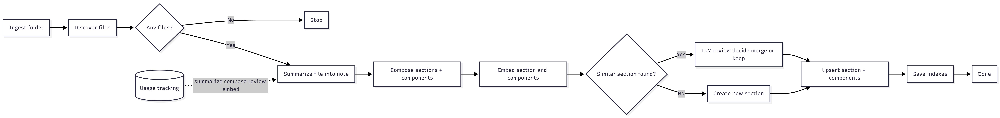
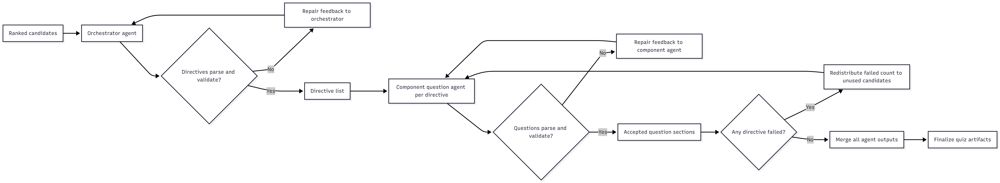

# study-agent

An AI-powered study assistant written in Go. It ingests notes, extracts
structured knowledge, generates adaptive quizzes, tracks performance, and
streams chat responses — available as both a terminal TUI and a web interface.





---

## Requirements

- Go 1.21+
- Node.js 20+ and npm (for the web UI)
- [`studyforge`](https://github.com/Jadog1/study-forge) installed and on `$PATH`
- An API key for OpenAI, Anthropic Claude, VoyageAI, or a locally running Ollama instance

---

## Installation

```bash
go install ./cmd/sfa
```

---

## Web UI

The web interface provides the full Study Forge AI experience in the browser
with interactive charts, rich text editing, and a modern dashboard.

### Quick start (production)

```bash
# 1. Build the frontend
cd web && npm install && npm run build && cd ..

# 2. Start the server (serves both API and frontend)
sfa web
```

This opens `http://localhost:8080` in your browser automatically.

### Development mode

Run the Go API server and Vite dev server separately for hot-reload:

```bash
# Terminal 1 — API server
go install ./cmd/sfa && sfa web --dev

# Terminal 2 — Vite dev server with hot-reload
cd web && npm run dev
```

The Vite dev server runs on `http://localhost:5173` and proxies `/api` requests
to the Go server on port 8080.

### Web command flags

| Flag | Default | Description |
| --- | --- | --- |
| `--port, -p` | `8080` | Port for the HTTP server |
| `--dev` | `false` | Development mode (API only, frontend via Vite) |
| `--no-browser` | `false` | Don't auto-open browser on startup |

### Web UI pages

| Page | Description |
| --- | --- |
| **Chat** | Streaming AI chat with markdown rendering and tool-call indicators |
| **Knowledge** | Browse ingested sections and components with search, filtering, and quiz performance metrics |
| **Quiz Dashboard** | Analytics with charts, quiz history, coverage tracking, and quiz generation with live progress |
| **Classes** | Full class management — syllabus, context profiles, note roster, coverage scopes |
| **Usage** | Token and cost analytics with time filters, per-model breakdown, trend charts, and CSV export |
| **Settings** | Provider/model configuration, per-role overrides, embeddings, SFQ settings, and model pricing |

---

## Terminal TUI

The original terminal experience is still available as the default command:

```bash
sfa
```

- Chat: stream model responses in a chat window
- Knowledge: browse sections and components
- Quiz Dashboard: quiz metrics and tracked sessions
- Classes: create/select classes and attach context files
- Usage: token and cost tracking
- Settings: manage provider keys/models and sfq command

Controls: `Tab`/`Shift+Tab` to switch panes, `q` to quit, `Esc` to leave edit mode, `Ctrl+P` for command palette.

## CLI Quick Start

```bash
# 1. Optional: pre-create app data
sfa init

# App data is also created automatically the first time you run any command.
# Edit ~/.study-forge-ai/config.yaml — add your API key and choose a provider

# 2. Create a class
sfa class create linear-algebra

# 3. Ingest notes
sfa ingest ./notes/math --class linear-algebra

# 4. Export knowledge for sharing (optional)
sfa export ./linear-algebra-knowledge.json --class linear-algebra

# 5. Generate a quiz
sfa generate linear-algebra

# 6. Study the quiz
sfa study ~/.study-forge-ai/quizzes/linear-algebra/quiz-<id>.yaml

# 7. Render to HTML via studyforge
studyforge build ~/.study-forge-ai/quizzes/linear-algebra/quiz-<id>.yaml

# 8. Record your results
sfa complete ~/.study-forge-ai/quizzes/linear-algebra/quiz-<id>.yaml

# 9. Generate adaptive follow-up quiz
sfa adapt linear-algebra
```

---

## CLI Commands

| Command | Description |
| --- | --- |
| `sfa` | Launch the terminal TUI |
| `sfa web` | Start the web UI server |
| `sfa init` | Initialise `~/.study-forge-ai/` app data |
| `sfa ingest <path> [--class <name>]` | Ingest and process notes from a folder |
| `sfa export [output-path] [--class <name>] [--include-embeddings]` | Export sections/components as shareable JSON |
| `sfa quiz <class>` | Generate a quiz from ingested notes |
| `sfa quiz-benchmark <class> [--models ...] [--runs N]` | Compare quiz-generation reliability and cost across Claude models |
| `sfa search [--tags ...] [--class ...]` | Search ingested notes |
| `sfa class create <name>` | Create a new class |
| `sfa class list` | List all classes |
| `sfa usage` | Print usage totals |
| `sfa pricing list\|set\|unset\|detect` | Manage model pricing |

---

## Configuration — `~/.study-forge-ai/config.yaml`

```yaml
provider: openai          # openai | claude | local

embeddings:
  provider: openai        # openai | voyage | local
  model: text-embedding-3-small

openai:
  api_key: sk-...
  model: gpt-4o

claude:
  api_key: sk-ant-...
  model: claude-3-5-sonnet-20241022

voyage:
  api_key: pa-...
  model: voyage-3-large

local:
  endpoint: http://localhost:11434  # Ollama base URL or OpenAI-compatible base URL
  embeddings_endpoint: http://localhost:8000/v1/embeddings
  model: llama3

sfq:
  command: sfq

# Appended verbatim to every AI prompt.
custom_prompt_context: |
  Focus on conceptual understanding over memorisation.
  Include real-world analogies where possible.
```

> **Security**: `~/.study-forge-ai/config.yaml` lives outside the repo so API keys stay out of version control by default. Never copy or symlink this file into the repo.

## Benchmarking Claude Models

Use `quiz-benchmark` to compare orchestration and question-generation behavior
between models (for example, Haiku vs Sonnet) on your real class data.

Examples:

```bash
# Quick compare (5 runs/model, 10 questions each)
sfa quiz-benchmark linear-algebra \
  --models claude-4-5-haiku,claude-4-5-sonnet \
  --runs 5 \
  --count 10 \
  --out ./benchmark-linear-algebra.json

# Focus on one topic tag and keep generated quizzes for manual review
sfa quiz-benchmark linear-algebra \
  --models claude-4-5-haiku,claude-4-5-sonnet \
  --runs 8 \
  --count 12 \
  --tags eigenvalues \
  --keep \
  --out ./benchmark-eigenvalues.json
```

The benchmark reports per model:

- Success rate
- Exact question-count compliance
- Average latency
- Average orchestrator/component retry counts
- Token usage and estimated cost

### Recommended: use environment variables

For stronger security (CI, shared machines, dotfile repos), set keys as environment variables instead of storing them in the config file. Environment variables always take precedence over the config file at runtime:

| Environment variable | Provider |
| --- | --- |
| `OPENAI_API_KEY_SFA` | OpenAI |
| `ANTHROPIC_API_KEY_SFA` | Anthropic Claude |
| `VOYAGE_API_KEY_SFA` | VoyageAI |

API keys are **exclusively** sourced from these environment variables — they are never read from `config.yaml` and are always stripped before any write to disk. The `api_key` fields in `config.yaml` will always be empty. A good place to set the vars is your shell profile (`~/.bashrc`, `~/.zshrc`):

```bash
export OPENAI_API_KEY_SFA="sk-..."
export ANTHROPIC_API_KEY_SFA="sk-ant-..."
export VOYAGE_API_KEY_SFA="pa-..."
```

---

## Workspace Layout

```text
~/.study-forge-ai/
  config.yaml              ← provider credentials
  notes/
    raw/                   ← copy raw notes here (optional)
    processed/             ← AI-extracted metadata (YAML + index.json)
  classes/
    <class>/
      syllabus.yaml        ← weekly topics
      rules.yaml           ← exam style expectations
      context.yaml         ← file paths to inject as class context in chat/AI
  quizzes/
    <class>/
      quiz-<ts>.yaml       ← generated quiz (studyforge input)
      quiz-<ts>-results.json
  plans/
  cache/
```

---

## AI Provider Plugins

Each provider lives in `plugins/<name>/` and implements the `AIProvider` interface:

```go
type AIProvider interface {
    Generate(prompt string) (string, error)
    Name() string
}
```

| Plugin | Location | Backend |
| --- | --- | --- |
| `openai` | `plugins/openai/` | OpenAI Chat Completions |
| `claude` | `plugins/claude/` | Anthropic Messages API |
| `local` | `plugins/local/` | Ollama `/api/generate` |

---

## Quiz Format (studyforge input)

All generated quizzes conform to this structure so `studyforge` can render them:

```yaml
title: Example Quiz
class: linear-algebra
tags:
  - vectors
sections:
  - type: question
    id: q-001
    question: What is a vector?
    hint: Think magnitude and direction.
    answer: A quantity with both magnitude and direction.
    reasoning: Vectors represent directional quantities in physics and math.
    tags:
      - vectors
      - fundamentals
```

---

## Example Workflow

```text
Ingest notes → extract metadata → save to index
         ↓
Generate quiz (using summaries + weak-area awareness)
         ↓
Study / render with studyforge
         ↓
Complete quiz (record correct / incorrect)
         ↓
Adapt: generate targeted follow-up questions on weak tags
         ↓
Repeat
```

---

## Extending Prompts

Edit `internal/prompts/prompts.go` to adjust any of the four built-in templates:

| Function | Purpose |
| --- | --- |
| `SummarizeNote` | Extracts summary, tags, and concepts from raw notes |
| `GenerateQuestions` | Produces a full quiz YAML document |
| `AdaptQuestions` | Generates weak-area targeted follow-ups |
| `VariationQuestion` | Reframes an existing question with a new angle |

Or use `custom_prompt_context` in `~/.study-forge-ai/config.yaml` to append instructions without
touching the code.
